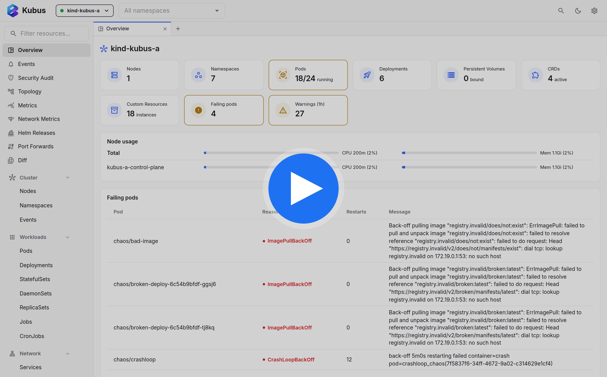

# Kubus

Kubus is a free, open-source Kubernetes GUI for working across clusters from
your local machine. It uses your existing kubeconfig to browse and edit
resources, stream logs, open shells, forward ports, watch metrics, inspect Helm
releases, and more.

**The docs are the main entry point:** [kubus-app.dev](https://kubus-app.dev/)

[](https://www.youtube.com/watch?v=b86yKodD5Mw)

## Start Here

- [Install Kubus](https://kubus-app.dev/install/)
- [Quickstart](https://kubus-app.dev/quickstart/)
- [User guide](https://kubus-app.dev/guide/)
- [Reference](https://kubus-app.dev/reference/)
- [Contributing and development](https://kubus-app.dev/community/)
- [Desktop releases](https://github.com/FloSch62/Kubus/releases)


## Run From Source

Requires Node.js >= 22 and pnpm:

```bash
pnpm install
pnpm build
pnpm start
```

For development setup, release steps, architecture, security details, and test
clusters, use the docs.

## License

[MIT](./LICENSE)
