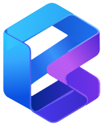

# { .kubus-hero-logo } Kubus

A free, open-source Kubernetes GUI. Connect to all your clusters at once — browse
and edit every resource (CRDs included), stream aggregated logs, open shells, forward
ports, watch metrics and manage Helm — from one polished UI that runs entirely on your machine.

[Get started :material-arrow-right:](install/index.md){ .md-button .md-button--primary }
[Download :simple-github:](https://github.com/FloSch62/Kubus/releases){ .md-button }

{ .shadow }
{ .shadow }

## Why Kubus?

`kubectl` is fast but invisible — you can't *see* your clusters. Dashboards are pretty
but live in a pod and need RBAC, ingress and a login. Kubus sits in between: a desktop-grade
UI that runs as a **local app**, talks to your clusters with **your existing kubeconfig**, and
never sends a byte off your machine.

-   :material-kubernetes: **Every cluster at once**

    ---

    Select any number of kubeconfig contexts and lists merge into one view with a
    cluster column. Stop juggling `kubectl config use-context`.

    [:octicons-arrow-right-24: Connecting clusters](guide/clusters.md)

-   :material-cube-outline: **Every resource kind**

    ---

    Built-in workloads, networking, config, storage and RBAC — **plus every CRD**,
    discovered dynamically with its printer columns rendered as real columns.

    [:octicons-arrow-right-24: Browsing resources](guide/browsing-resources.md)

-   :material-script-text-outline: **Aggregated logs**

    ---

    Stream logs from many pods at once, colour-coded per pod, with regex filter,
    follow, timestamps, previous-container logs and one-click download.

    [:octicons-arrow-right-24: Logs](guide/logs.md)

-   :material-console: **Shells & debugging**

    ---

    A real terminal into any container, ephemeral debug containers for distroless
    pods, and a privileged **node shell** that `nsenter`s into the host.

    [:octicons-arrow-right-24: Shell & debug](guide/shell.md)

-   :material-chart-areaspline: **Metrics & health**

    ---

    CPU/memory history charts from metrics-server, and an overview dashboard that
    flags failing pods, unavailable workloads, restarts and warnings.

    [:octicons-arrow-right-24: Metrics & health](guide/metrics.md)

-   :material-ship-wheel: **Helm, no binary**

    ---

    List releases, inspect user and computed values, read manifests, browse history,
    roll back and uninstall — the server decodes release secrets itself.

    [:octicons-arrow-right-24: Helm releases](guide/helm.md)

-   :material-keyboard: **Command palette**

    ---

    ++ctrl+k++ searches resources, kinds and pages, runs actions on anything and
    drives the whole app from the keyboard.

    [:octicons-arrow-right-24: Command palette](guide/command-palette.md)

-   :material-shield-lock: **Local & private**

    ---

    Binds to `127.0.0.1` only, guards every request with a per-run token, and
    redacts Secret values by default. Nothing leaves your laptop.

    [:octicons-arrow-right-24: Security model](reference/security.md)

## A 60-second tour

=== "Browse"

    Pick your clusters, pick a kind, and you get a live list that updates over a
    WebSocket watch — no refresh button. CRDs show their own `additionalPrinterColumns`.

    { .shadow }
    { .shadow }

=== "Inspect"

    Click any resource to slide open a details drawer with a human overview, a
    Monaco-powered YAML editor, events, a relationship map and (for pods/nodes) metrics.

    { .shadow }
    { .shadow }

=== "Act"

    Scale, restart, roll back, trigger a CronJob, cordon or drain a node, open a shell,
    forward a port — all from a row menu, the detail drawer or the command palette.

    { .shadow }
    { .shadow }

## Ready?

-   :material-download: **Install Kubus**

    ---

    Grab the desktop installer for Windows, macOS or Linux — or run it from source.

    [:octicons-arrow-right-24: Installation](install/index.md)

-   :material-rocket-launch: **Quickstart**

    ---

    From zero to browsing your first cluster in about five minutes.

    [:octicons-arrow-right-24: Quickstart](quickstart.md)

!!! info "Kubus is a local tool"

    Kubus is meant to run on *your* machine against clusters *you* already have
    credentials for. It is not a hosted multi-tenant dashboard. See the
    [security model](reference/security.md) for exactly what that means.
